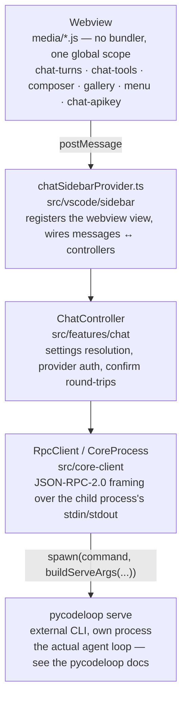

# Architecture

## Extension host vs webview

The extension host (Node, full VS Code API access) and the webview (a sandboxed browser context, `media/*.js`) never share memory — everything crosses via `postMessage`. `chatSidebarProvider.ts` is the seam: it receives typed `WebviewMessage`s from the panel and calls into `ChatController`/`SessionsController`/`SettingsController`, then posts typed events back.

## Talking to `pycodeloop serve`

`ChatController.ensureClient()` resolves the current settings (`readSettings()`), builds the CLI argument list (`buildServeArgs`), and spawns `pycodeloop serve` via `RpcClient`. That class wraps `CoreProcess` (a thin `child_process.spawn` wrapper) and speaks JSON-RPC-2.0, one object per line, matching exactly what the VS Code extension has always been — no in-process shortcuts, same protocol a language server would use.

Key notifications the extension listens for: `chat/textDelta`, `chat/turnEnd`, `chat/toolCall`, `chat/toolResult`, `chat/usage`, `chat/context`, `chat/retry`, `chat/compactStart`/`chat/compactEnd`, and `chat/confirmRequest` (answered via `chat/confirmResponse`).

## Spawn failures

If `command` (default `pycodeloop`) isn't found on `PATH`, `spawn` emits `ENOENT`; `ChatController` turns that into a `cliMissing` event so the webview can offer the one-click installer (`installCli()` in `chat.controller.ts`), which runs `pip install --user pycodeloop` and then re-resolves the user-scripts directory into `PATH` before retrying — see [Troubleshooting](../how-to/troubleshooting.md).

## Credentials

API keys never touch a setting or the JSON-RPC wire in plaintext beyond process env: `credentials.service.ts` stores them in VS Code's `SecretStorage` and injects them into the spawned process's environment (e.g. `ANTHROPIC_API_KEY`) via `spawnEnvForApiKey`.
